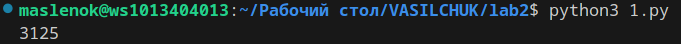
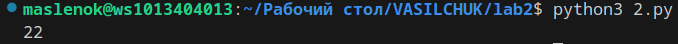
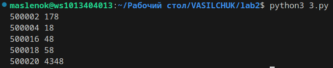

#ЗАДАЧА 1
Ученица составляет 5-буквенные слова из букв ГЕПАРД. При этом в каждом слове ровно одна буква Г, слово не может начинаться на букву А и заканчиваться буквой Е. Какое количество слов может составить ученица?

__Описание проделанной работы:__
Импортировали itertools для комбинаторики;
Определили слово;
Создали счётчик;
Запустили цикл;
При соблюдении всех условий счётчик увеличивается;
По окончании работы цикла выводим значение счётчика.

#ЗАДАЧА 2
Значение выражения 5^36 + 5^24 − 25 записали в системе счисления с основанием 5. Сколько цифр 4 содержится в этой записи?

__Описание проделанной работы:__
Определили переменную в которую засунули значение выражения;
инициализировали строку;
С помощью цикла подсчитываем колличество 4 в проценте от деления на пять;
Вывели счётчик.

#ЗАДАЧА 3
Найдите 5 чисел больших 500000, таких, что среди их делителей есть число, оканчивающееся на 8, при этом этот делитель не равен 8 и самому числу. В качестве ответа приведите 5 наименьших чисел, соответствующих условию.

Формат вывода: для каждого из 5 таких найденных чисел в отдельной строке сначала выводится само число, затем минимальный делитель, оканчивающийся на 8, не равный 8 и самому числу.

__Описание проделанной работы:__
Определили функцию в которой определяем с помощью счётчика делители числа, записываем делители в список и по окончанию работы функции возвращаем список;
инициализируем счётчик;
запускаем цикл содержащий числа;
результат прогона числа через функцию записываем в переменную;
Запускаем ещё один счётчик который проходит по делителям;
Если все условия соблюдены в счётчике происходит вывод числа и наименьшего подходящего делителя;
Если изначальный счётчик равен 5 заканчиваем работу программы.
