#ШПАРГАЛКА ПО РАБОТЕ С GIT
git clone ссылка
gid add .
git commit -m "Name of commit"
git push origin name_of_branch
#ЗАДАЧА 1
Составить словарь словарей расстояний между городами

__Описание проделанной работы:__
Создали функцию расчёта расстояния по формуле;
Инициализировали словарь;
Запустили два цикла в которых определяем словарь словарей и его значения;
Вывели словарь.

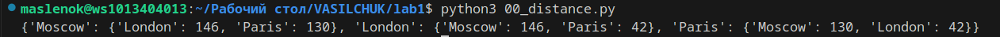
#ЗАДАЧА 2
Определить площадь и находятся ли две точки в окружности или нет.

__Описание проделанной работы:__
Высчитали и округлили площадь и вывели её;
Создали функцию которая определяет по формуле находится ли точка в окружности или нет;
Применили функцию к двум точкам и вывели результат.

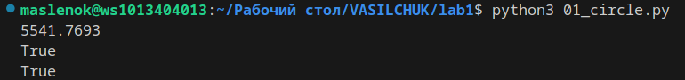
#ЗАДАЧА 3
Скомбинировать цифры так, чтобы в результате операций получилось 25.

__Описание проделанной работы:__
Определил нужное выражение.

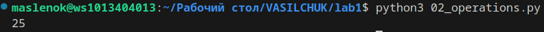
#ЗАДАЧА 4
Вывести фильмы по заданному порядку.

__Описание проделанной работы:__
Сделал вывод с помощью срезов.

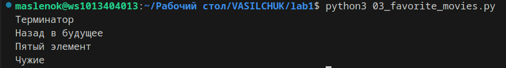
#ЗАДАЧА 5
Поработать со списками.

__Описание проделанной работы:__
Инициализировал нужные списки и подсписки;
Вывел рост отца;
Вывел общий рост семьи как их сумму.

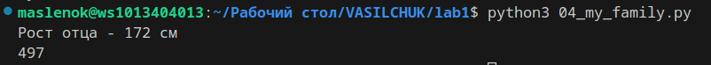
#ЗАДАЧА 6
Поработать со списками при помощи специализированных команд.

__Описание проделанной работы:__
Вставил в список медведя между львом и кенгуру;
Вывел список;
Добавил один список к другому;
Вывел список;
Убрал ненужное животное:( ;
Вывел список;
Вывел при помощи цикла кто в какой сидит клетке.

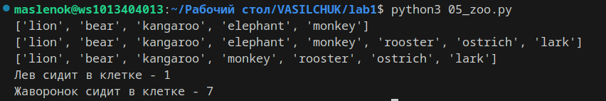
#ЗАДАЧА 7
Посчитать значения по ключам в словаре и по соседним значениям в списке.

__Описание проделанной работы:__
Определил нужный список слов;
C помощью цикла подсчитал общее колличество минут;
Проделал то же самое со словарём;
Вывел полученные значения.

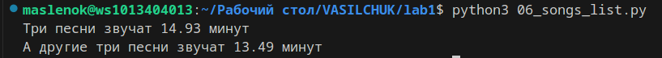
#ЗАДАЧА 8
Расшифровать сообщение.

__Описание проделанной работы:__
Расшифровал каждое слово при помощи срезов;
Объединил все слова в одну строчку;
Вывел строчку.

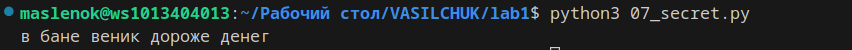
#ЗАДАЧА 9
Поработать со специализированными командами для множеств

__Описание проделанной работы:__
Создал разные множества по условию;
Вывел их на консоль.
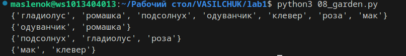

#ЗАДАЧА 10
Создать словарь цен на продукты.

__Описание проделанной работы:__
Создал словарь цен на продукты в ручную.

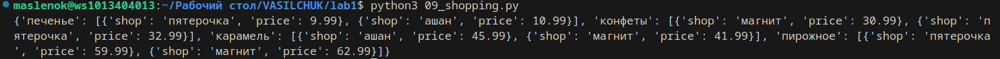
#ЗАДАЧА 11
Вывести стоимость предметов интерьера.

__Описание проделанной работы:__
Рассчитал на какую сумму лежит разного товара на складе;
Сделал вывод по условию.

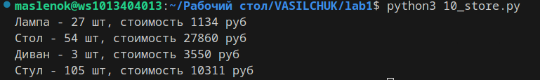